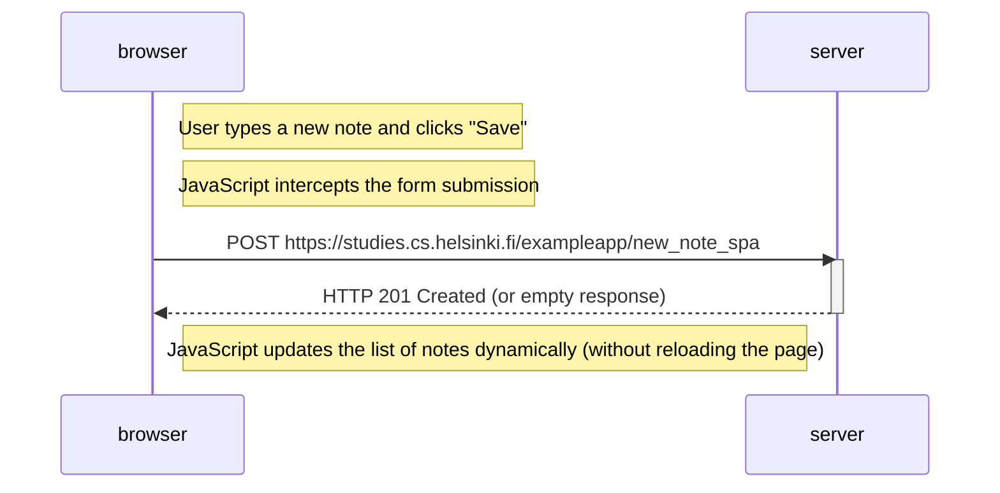

```mermaid
sequenceDiagram
participant browser
participant server

    Note right of browser: User types a new note and clicks "Save"

    Note right of browser: JavaScript intercepts the form submission

    browser->>server: POST https://studies.cs.helsinki.fi/exampleapp/new_note_spa
    activate server
    server-->>browser: HTTP 201 Created (or empty response)
    deactivate server

    Note right of browser: JavaScript updates the list of notes dynamically (without reloading the page)
```
